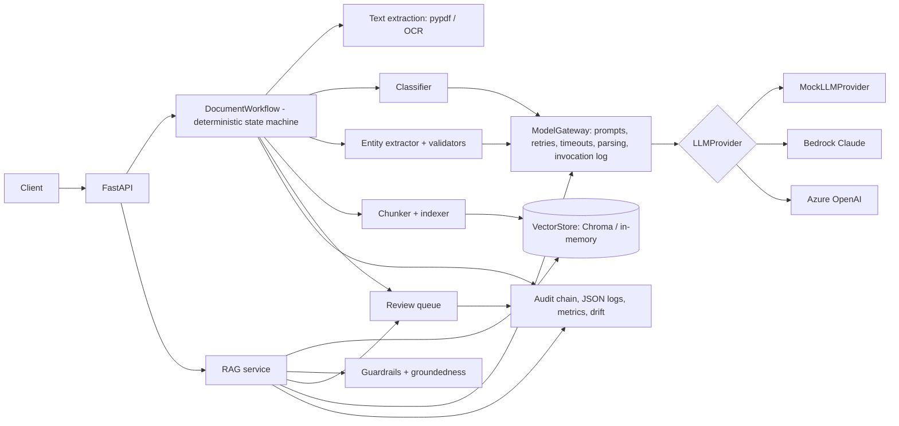

# Implementation Plan: Financial Document Intelligence & Agentic Workflow Platform

## 1. Starting point

The repository was empty (no git history, no code). The host had only system Python 3.9, so
Python 3.12 is provisioned with `uv`. Tesseract/Poppler are not installed on the dev host; OCR is
therefore an optional capability that is exercised in Docker/CI where the binary is installed.

## 2. Architecture

Layers:

| Layer | Package | Rule |
|---|---|---|
| API | `app/api` | HTTP only; maps API schemas to domain services |
| Services | `app/{ingestion,classification,extraction,retrieval,rag,workflows,human_review,audit,evaluation,drift}` | business logic; depends on protocols only |
| Providers | `app/providers/*` | the only place cloud SDKs are imported |
| Domain | `app/domain` | pure Pydantic models and enums |
| Core | `app/core` | config, errors, hashing, resilience |
| Persistence | `app/persistence` | SQLAlchemy repositories (SQLite locally) |

## 3. Phases

| # | Phase | Deliverable |
|---|---|---|
| 1-2 | Setup, domain, config | pyproject, Makefile, settings, domain models, errors, retry/timeout |
| 3-4 | Ingestion + extraction | upload validation, dedupe, secure storage, pypdf, OCR abstraction |
| 5-6 | Classification + extraction | prompt-driven classifier, typed per-type schemas, evidence verification, validators |
| 7-9 | Retrieval + RAG | chunking, embeddings, vector store, retrieval, grounded answers, citations |
| 10-13 | Workflow, guardrails, HITL, audit | state machine, review queue, hash-chained audit log |
| 14-15 | Evaluation + test harness | metrics, runner, thresholds, baseline, quality gate; unit/integration/e2e tests |
| 16-18 | Observability, drift, security | JSON logs w/ redaction, metrics, cost, drift report, auth |
| 19-20 | Docker + CI | Dockerfile, compose, GitHub Actions |
| 21-22 | Synthetic data + demo | 15+ synthetic PDFs with ground truth and edge cases, scripted demo |
| 23-25 | Docs + audit | README, ADRs, interview docs, completion report |

## 4. Dependencies

Runtime: FastAPI, Pydantic v2, pydantic-settings, SQLAlchemy 2, pypdf, pypdfium2 + pytesseract
(OCR), chromadb, langchain-core, langchain-text-splitters, langchain-aws, langchain-openai, boto3,
opentelemetry-api/sdk. Dev: pytest, ruff, mypy, reportlab (synthetic PDF generation).

## 5. Major design decisions

1. **LangChain as an integration layer only** (ADR-001): model adapters, prompt templates, text
   splitting. No LangChain agents; orchestration is our own explicit state machine.
2. **Chroma (embedded) behind a `VectorStore` protocol** (ADR-002), with an in-memory store for
   tests and failure injection.
3. **Provider abstraction** (ADR-003): `LLMProvider` / `EmbeddingProvider` protocols; a factory
   selects mock/Bedrock/Azure from configuration.
4. **Deterministic orchestration** (ADR-004): explicit states, allowed transitions, bounded retries,
   every transition audited.
5. **RAG with verifiable citations** (ADR-005): cited chunk IDs must come from the retrieved set;
   deterministic groundedness check on numbers and content tokens.
6. **Deterministic-first evaluation** (ADR-006) with thresholds and baseline regression tolerance
   enforced in CI.
7. **HITL on explicit reason codes** (ADR-007).
8. **Observability via protocols** (ADR-008): in-memory metrics locally, OpenTelemetry adapter.
9. **Sensitive-data handling** (ADR-009): account numbers masked in extraction results, page
   text PII-masked before indexing (raw text is stored unmasked), log redaction.

## 6. Mock mode

`MockLLMProvider` is a deterministic simulated model: keyword classifier, label-based regex
extractor, extractive answerer. It goes through exactly the same gateway (prompt rendering, JSON
parsing, schema validation, retries, invocation logging) as the real providers, and every output is
tagged `is_mock=true`. The hashing embedder is lexical, not semantic.

## 7. Risks

| Risk | Mitigation |
|---|---|
| Real Bedrock/Azure calls cannot be verified without credentials | Adapters tested with LangChain fake chat models; documented as credential-dependent |
| Mock results overstate real-model quality | Eval reports are labelled `is_mock`; thresholds documented as mock-mode gates |
| Chroma version churn | Pinned major version; in-memory fallback |
| OCR binary not present locally | Scanned PDFs route to review with `ocr_unavailable`; Docker image ships tesseract |
| Synchronous processing blocks API workers | Documented; queue-backed workers are on the roadmap |
