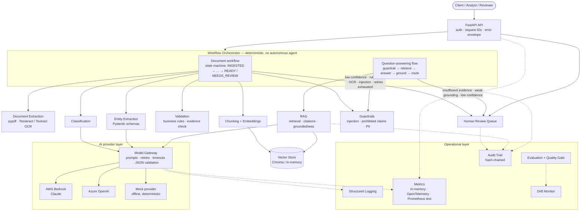
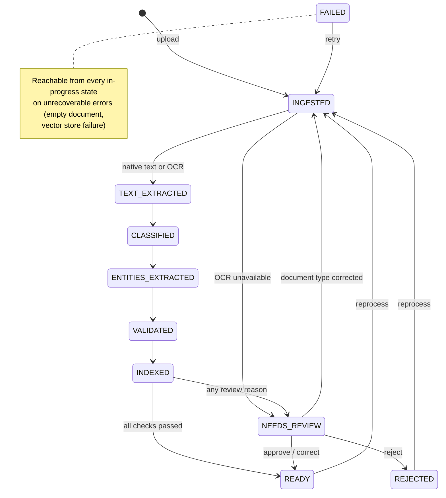

# fin-docintel

[](https://github.com/zamanmaruf/Financial_Document_Intelligence-Agentic_Workflow_Platform/actions/workflows/ci.yml)

**Financial Document Intelligence & Agentic Workflow Platform** — turn financial PDFs into
classified, validated, cited and auditable data, with humans in the loop wherever the machine is
unsure.

```text
PDF ─► text / OCR ─► classify ─► extract ─► validate ─► chunk ─► embed ─► index
                                                                            │
question ─► guardrails ─► retrieve ─► answer ─► cite ─► groundedness ─► route ─► answer | refuse | review
                                                                            │
                          every step ─► audit trail · metrics · evaluation · drift
```

It runs **fully offline in mock mode** with no cloud credentials. Configuration switches it to
**Claude on AWS Bedrock** (primary) or **Azure OpenAI** (secondary); no business code changes.

> **Status:** reference implementation / portfolio project. It is not certified for any
> regulatory regime and makes no compliance claims. Mock-mode scores describe the pipeline, not
> model accuracy. See [Known limitations](#23-known-limitations).

---

## At a glance

| | |
|---|---|
| **Tests** | 256: 153 unit · 88 integration · 15 end-to-end. 255 pass; 1 skips when Tesseract isn't installed |
| **Coverage** | 94% of `app/` |
| **Static checks** | `ruff` lint + format, `mypy --strict`, all clean |
| **Quality gate** | 27 checks (absolute thresholds + regression vs. baseline), passing |
| **Document types** | invoice · bank statement · income statement · balance sheet · fund summary |
| **LLM providers** | Mock (default) · AWS Bedrock (Claude) · Azure OpenAI, behind one interface |
| **Vector store** | Chroma (persistent) or in-memory |
| **API** | FastAPI, 15 required endpoints + 4 extras, OpenAPI UI at `/docs` |

## Quick start

```bash
make install     # Python 3.12 venv + dependencies (uses uv when available)
make test        # full suite, offline, about 15 seconds
make dev         # API on http://127.0.0.1:8000 — open /docs
make demo        # in a second terminal: upload → process → ask → review → audit → evaluate
```

Or with Docker only:

```bash
make docker-run  # docker compose up --build → http://127.0.0.1:8000/health
```

## What is real, what is mocked

| Area | Status |
|---|---|
| PDF ingestion, text extraction, Tesseract OCR, classification/extraction pipeline, validation, chunking, indexing, retrieval, RAG, citations, groundedness, guardrails, human review, audit chain, metrics, evaluation, drift | **Implemented** and exercised by tests and the demo |
| AWS Bedrock (Claude + Titan embeddings), Azure OpenAI (chat + embeddings), AWS Textract | **Implemented**, unit-tested with fake chat models and stubbed clients; **not run against live cloud services** in this environment |
| LLM in the default configuration | **Mock**: a deterministic rule-based provider that implements the same interface. Labelled `is_mock: true` everywhere |
| Embeddings in the default configuration | **Lexical hashing vectoriser**, offline and deterministic, with no semantic understanding |
| GitHub Actions CI | **Implemented** and passing on GitHub (quality + Docker jobs) |
| Encryption at rest, TLS, retention, SSO, rate limiting, tracing | **Documented considerations only** ([Security & privacy](#21-security--privacy)) |
| Fine-tuning | **Design document only** ([`docs/fine-tuning-pathway.md`](docs/fine-tuning-pathway.md)) |

---

## Table of contents

1. [Project overview](#1-project-overview)
2. [Business problem](#2-business-problem)
3. [Key capabilities](#3-key-capabilities)
4. [Architecture](#4-architecture)
5. [Architecture diagram](#5-architecture-diagram)
6. [End-to-end processing workflow](#6-end-to-end-processing-workflow)
7. [Technology stack](#7-technology-stack)
8. [Repository structure](#8-repository-structure)
9. [Local setup](#9-local-setup)
10. [Mock mode](#10-mock-mode)
11. [AWS Bedrock configuration](#11-aws-bedrock-configuration)
12. [Azure OpenAI configuration](#12-azure-openai-configuration)
13. [Example: upload and process a document](#13-example-upload-and-process-a-document)
14. [Example: ask a question (RAG)](#14-example-ask-a-question-rag)
15. [Human-in-the-loop review](#15-human-in-the-loop-review)
16. [Evaluation methodology](#16-evaluation-methodology)
17. [Observability](#17-observability)
18. [Drift monitoring](#18-drift-monitoring)
19. [Testing](#19-testing)
20. [CI/CD](#20-cicd)
21. [Security & privacy](#21-security--privacy)
22. [Design trade-offs](#22-design-trade-offs)
23. [Known limitations](#23-known-limitations)
24. [Production roadmap](#24-production-roadmap)

**Further reading:** [architecture decision records](docs/adr) (ADR-001 to ADR-009) ·
[codebase walkthrough](docs/codebase-walkthrough.md) ·
[interview guide](docs/interview-guide.md) ·
[interview question bank](docs/interview-questions.md) (112 questions) ·
[fine-tuning pathway](docs/fine-tuning-pathway.md) ·
[project completion report](PROJECT_COMPLETION_REPORT.md)

---

## 1. Project overview

`fin-docintel` is a FastAPI service that turns unstructured financial PDFs into:

- a **document type** with a confidence score and a short rationale;
- **typed, validated fields**, where every field carries its value, the evidence quote it came
  from (verified against the source text), a confidence score and a validation status;
- a **searchable index** of page-aware chunks with metadata;
- **cited answers** to natural-language questions, with deterministic groundedness scoring,
  guardrails, and an explicit refusal when the evidence is insufficient;
- **review cases** whenever confidence, validation, grounding or safety checks fail, resolved by
  approve / reject / correct actions recorded in a **hash-chained audit trail**.

Every model call goes through a single `ModelGateway`. It applies versioned prompts, timeouts,
bounded retries, JSON repair and Pydantic validation, and records each call in an invocation
ledger: provider, model, prompt version and hash, tokens, latency, estimated cost and outcome.

The LLM does extraction and language work. **It never decides control flow**: routing is a
deterministic state machine whose every path is enumerable, testable and audited.

## 2. Business problem

Accounts payable, lending, KYC, fund operations and audit teams spend large amounts of time
reading PDFs, re-keying values into systems and answering questions such as "what is the amount
due on this invoice?" or "what was net income last year?". The hard requirements are:

- **Volume and variety.** There are many layouts, and some documents are scanned.
- **Accuracy.** A wrong amount or account number has financial consequences.
- **Explainability.** Every automated value must be traceable to a source page and quote.
- **Control.** Low-confidence or conflicting cases must reach a human, and every decision must be
  auditable after the fact.
- **Vendor risk.** Depending on a single model provider is a concentration risk.

The platform uses LLMs only at well-defined, validated steps inside a deterministic workflow, and
routes uncertainty to people instead of hiding it.

## 3. Key capabilities

| Capability | Implemented as |
|---|---|
| PDF upload with validation | size cap enforced while streaming, extension + `%PDF` magic check, encrypted / active-content flags, SHA-256 de-duplication |
| Native text extraction | `pypdf`, per page |
| OCR fallback | Tesseract (local, via `pypdfium2` rendering) or AWS Textract; OCR use routes to review, OCR unavailability routes to review |
| Classification | LLM with a versioned prompt → `ClassificationResult` (type, confidence, rationale) |
| Structured extraction | per-type Pydantic schemas whose field descriptions feed the prompt; evidence quotes verified against the page text |
| Validation | type, format, range and cross-field business rules (table below) |
| Chunking + embeddings | page-aware recursive splitter (600 chars, 80 overlap by default); hashing (offline), Bedrock Titan v2 or Azure embeddings |
| Vector store | Chroma (persistent) or in-memory behind a `VectorStore` protocol, with metadata filters |
| RAG | top-k + similarity threshold + filters → grounded prompt → JSON answer → citation binding |
| Citations | `document_id`, `page_number`, `chunk_id`, `text_snippet`, `retrieval_score`; only retrieved chunks may be cited |
| Groundedness | deterministic: every number must appear in cited evidence, and each sentence needs ≥ 0.6 token support; optional LLM-as-judge in evaluation |
| Guardrails | prompt-injection detection on questions and document text, prohibited financial-advice filter, PII masking |
| Human-in-the-loop | review queue with approve / reject / correct; corrections re-validated; re-extraction when the type is corrected |
| Audit | append-only, SHA-256 hash-chained events; `GET /audit/verify` detects tampering |
| Observability | structured JSON logs with request / document / workflow IDs, in-memory + OpenTelemetry metrics, Prometheus text format |
| Evaluation | classification, extraction, retrieval, answer and workflow metrics; thresholds + regression gate |
| Drift | PSI and rate / ratio comparisons against a saved baseline, with sample-size gating |
| Auth (optional) | `X-API-Key` authentication with viewer < analyst < reviewer < admin roles |

### Supported document types

Schemas live in [`app/extraction/schemas.py`](app/extraction/schemas.py). **Bold** fields are
required; a missing required field routes the document to review.

| Type | Fields | Cross-field rule |
|---|---|---|
| Invoice | **invoice_number**, **invoice_date**, **vendor**, customer, currency, subtotal, tax, **amount_due** | subtotal + tax = amount_due |
| Bank statement | bank_name, account_holder, **account_number_masked**, **statement_period**, currency, **opening_balance**, total_credits, total_debits, **closing_balance** | opening + credits − debits = closing |
| Income statement | **company_name**, **reporting_period**, **currency**, **revenue**, operating_expenses, operating_income, **net_income** | operating income ≤ revenue − opex; net income ≤ revenue |
| Balance sheet | **company_name**, **reporting_period**, **currency**, cash, **total_assets**, **total_liabilities**, **shareholders_equity** | assets = liabilities + equity |
| Fund summary | **fund_name**, **reporting_period**, currency, **net_asset_value**, nav_per_share, ytd_return_pct, management_fee_pct | management fee within 0–5% |

Every type also gets these checks: required fields, field format (ISO 4217 currency, dates,
amounts, percentages, masked account numbers), conflicting values within the document, and
evidence that cannot be located in the source text. Amount comparisons use a 0.5% tolerance
(`amount_tolerance_ratio`).

## 4. Architecture

The system is a **modular monolith** with a Python `Protocol` at every external dependency, so
each piece can be replaced or scaled out independently later.

- **API layer** (`app/api`): FastAPI routers, request/response schemas, auth dependencies,
  request-ID middleware and a uniform error envelope.
- **Workflow orchestrator** (`app/workflows`): a deterministic state machine for documents.
  Illegal transitions raise, and every transition is audited
  ([ADR-004](docs/adr/ADR-004-deterministic-workflow.md)).
- **Question-answering flow** (`app/rag/service.py`): the second deterministic flow, a fixed
  sequence of guardrail → retrieval → answer → citation binding → groundedness → routing. It
  runs per question rather than per document, so it is a separate service instead of extra
  states in the document state machine.
- **Domain services**: ingestion, classification, extraction + validation, retrieval (chunker,
  indexer, retriever), RAG, guardrails, human review, audit, evaluation and drift.
- **Model gateway** (`app/services/model_gateway.py`): the only path to an LLM.
- **Provider layer** (`app/providers`): LLM (mock, or Bedrock / Azure via LangChain adapters),
  embeddings, vector store, OCR and document storage, selected by `app/providers/factory.py`.
  No cloud SDK is imported anywhere else.
- **Persistence** (`app/persistence`): SQLAlchemy 2 over SQLite by default (any SQLAlchemy URL
  works), with one repository per aggregate.
- **Operational layer**: JSON logging with PII masking, metrics, audit chain, evaluation harness,
  quality gate and drift monitor.

All dependencies are wired once in `app/services/container.py` (`build_container`). Tests use the
same seam to inject fault-injecting mocks.

### API endpoints

| Method | Path | Minimum role (when auth is enabled) |
|---|---|---|
| GET | `/health` | public |
| GET | `/metrics` (`?format=prometheus`) | viewer |
| POST | `/documents/upload` | analyst |
| GET | `/documents`, `/documents/{id}` | viewer |
| POST | `/documents/{id}/process` | analyst |
| GET | `/documents/{id}/extractions` | viewer |
| POST | `/documents/{id}/ask`, `/ask` (corpus-wide) | viewer |
| GET | `/documents/{id}/audit` | viewer |
| GET | `/reviews`, `/reviews/{id}` | viewer |
| POST | `/reviews/{id}/approve`, `/reject`, `/correct` | reviewer |
| GET | `/evaluations` | viewer |
| POST | `/evaluations/run` | admin |
| GET | `/drift/report` | viewer |
| GET | `/audit/verify` | admin |

Errors use one envelope: `{"error": {"type": "…", "message": "…"}, "request_id": "…"}`. Interactive OpenAPI
documentation is served at `/docs`.

## 5. Architecture diagram



## 6. End-to-end processing workflow

### Document state machine

Defined in [`app/workflows/state_machine.py`](app/workflows/state_machine.py). Any transition not
drawn here raises an error.



### Step by step

1. **Upload.** `POST /documents/upload` reads at most `max_upload_mb + 1` bytes and checks the
   `.pdf` extension and `%PDF` header. It inspects the PDF (page count, text layer, encryption,
   active-content markers), computes SHA-256 and de-duplicates. The file is written atomically
   under a generated ID, never the user-supplied name. Status: `INGESTED`.
2. **Process.** `POST /documents/{id}/process` runs the orchestrator synchronously:
   1. **Text extraction.** Native text comes from `pypdf`. If the text layer is too sparse
      (< 40 chars per page), OCR runs (Tesseract or Textract). Using OCR adds the `ocr_used`
      review reason; if no OCR engine is available the run ends in `NEEDS_REVIEW` with
      `ocr_unavailable`. Document text is scanned for indirect prompt injection
      (`guardrail_triggered`).
   2. **Classification.** A gateway call with prompt `classification.document_type` v1.0.0. An
      unknown type or confidence < 0.70 routes to review.
   3. **Extraction.** A gateway call with the type's schema. Values are coerced by Pydantic and
      evidence quotes are checked against the page text. Missing required fields, unverified
      evidence, conflicting values or confidence < 0.60 route to review.
   4. **Validation.** The business rules run and the outcome is recorded (`VALIDATED`); rule
      failures route to review.
   5. **Indexing.** Page text is PII-masked, split into page-aware chunks with metadata
      (document ID, type, page number, extraction method), embedded and upserted idempotently.
   6. **Decision.** Soft failures don't stop the pipeline. Every review reason is collected into
      **one consolidated review case** and the document ends in `NEEDS_REVIEW`; otherwise it
      ends in `READY`. Provider errors after bounded retries add `retries_exhausted`.
3. **Ask.** `POST /documents/{id}/ask` (or `POST /ask` corpus-wide) runs: input guardrail →
   retrieval → grounded prompt → JSON answer → citation binding (only retrieved chunk IDs are
   accepted) → groundedness → prohibited-claim check → confidence → answer, refusal or
   answer-review case. Confidence is a transparent heuristic, 0.6 × groundedness + 0.4 ×
   retrieval strength, not a calibrated probability.
4. **Review.** `GET /reviews`, then approve / reject / correct. Corrections are schema- and
   rule-validated before being stored as a new extraction version.
5. **Audit.** Every step writes an audit event. `GET /documents/{id}/audit` returns a document's
   history and `GET /audit/verify` checks the whole hash chain.

## 7. Technology stack

| Concern | Choice | Why |
|---|---|---|
| Language | Python 3.12 | modern typing (`StrEnum`, generics), ecosystem |
| API | FastAPI + Uvicorn | OpenAPI for free, Pydantic-native |
| Schemas | Pydantic v2 | validation at every boundary, including LLM output |
| Settings | pydantic-settings | typed environment config; `.env` for local use only |
| Persistence | SQLAlchemy 2 + SQLite | zero setup locally; change the URL for Postgres |
| PDF | pypdf, pypdfium2 | pure-Python text extraction; page rendering for OCR |
| OCR | Tesseract (pytesseract) / AWS Textract | local and managed options |
| LLM integration | LangChain (`langchain-aws`, `langchain-openai`) as adapters only | provider breadth without framework lock-in ([ADR-001](docs/adr/ADR-001-orchestration-framework.md)) |
| Primary LLM | Claude on AWS Bedrock (`ChatBedrockConverse`) | data stays in the AWS account and region |
| Secondary LLM | Azure OpenAI (`AzureChatOpenAI`) | vendor diversification |
| Embeddings | hashing (offline) / Bedrock Titan v2 / Azure `text-embedding-3-small` | offline default, managed options |
| Vector store | Chroma (persistent, embedded) / in-memory | ([ADR-002](docs/adr/ADR-002-vector-store.md)) |
| Observability | stdlib logging (JSON), in-memory metrics, OpenTelemetry metrics API | no mandatory external backend ([ADR-008](docs/adr/ADR-008-observability.md)) |
| Quality | pytest, pytest-cov, ruff, mypy `--strict` | |
| Packaging | Docker (non-root, read-only filesystem), docker compose, GitHub Actions | |

## 8. Repository structure

```text
app/
  api/            FastAPI app factory, routes (documents, reviews, evaluations, system), schemas, auth
  audit/          hash-chained audit service
  classification/ document classifier (gateway call + thresholds)
  core/           config, errors, hashing, clock/IDs, registry loader, retry/timeout, text utils
  domain/         enums and Pydantic domain models
  drift/          drift snapshot and comparison (PSI, rate deltas, ratios)
  evaluation/     metrics, evaluation runner, quality gate
  extraction/     per-type field schemas, extractor, validation rules
  guardrails/     prompt-injection scanner, PII masking, question/answer policy
  human_review/   review queue service (approve / reject / correct)
  ingestion/      upload validation, PDF inspection, text extraction + OCR fallback
  observability/  JSON logging, metrics (memory / OTel / Prometheus), cost estimation
  persistence/    SQLAlchemy tables and repositories
  prompts/        versioned prompt registry (YAML → PromptTemplate, hashed)
  providers/      llm/ (mock, Bedrock, Azure), embeddings/, vectorstore/, ocr/, storage/, factory
  rag/            RAG service, deterministic groundedness
  retrieval/      chunker, indexer, retriever
  services/       dependency container, model gateway
  workflows/      state machine and orchestrator
config/           document_types.yaml (mock keywords + label synonyms), drift.yaml, pricing.yaml
prompts/          classification/, extraction/, rag/, validation/ — versioned YAML prompts
evals/            datasets/, thresholds.yaml, baseline.json, drift_baseline.json
sample_data/      20 synthetic PDFs + ground_truth.json
scripts/          generate_sample_data, run_evals, quality_gate, drift_report, demo
tests/            unit/, integration/, e2e/, fixtures and shared helpers
docs/             adr/, interview guide and questions, codebase walkthrough, fine-tuning pathway
```

## 9. Local setup

**Requirements:**

- Python 3.12. The Makefile uses [`uv`](https://github.com/astral-sh/uv) when available and
  falls back to `venv` + `pip`.
- Optional: Tesseract for local OCR (`brew install tesseract` or `apt-get install tesseract-ocr`).
- Optional: Docker for container runs. The image already includes Tesseract.

```bash
make install          # creates .venv and installs the package + dev tools
cp .env.example .env  # optional: every setting has a mock-mode default
make dev              # http://127.0.0.1:8000, OpenAPI UI at /docs
```

Pinned, reproducible install (what CI and Docker use):

```bash
pip install -r requirements.lock && pip install -e ".[dev]"
```

Docker:

```bash
make docker           # docker build -t fin-docintel:local .
make docker-run       # docker compose up --build (mock mode, persistent /data volume)
```

The container runs as a non-root user with a read-only root filesystem, a tmpfs `/tmp`, a
`/data` volume and a `HEALTHCHECK` against `/health`.

### Make targets

| Target | What it does |
|---|---|
| `make install` | create `.venv` and install dependencies |
| `make dev` | run the API with auto-reload |
| `make test` | full test suite with coverage |
| `make test-unit` / `test-integration` / `test-e2e` | one test layer |
| `make lint` / `make format` / `make typecheck` | ruff check + format check / auto-format / mypy strict |
| `make eval` | run the evaluation harness → `reports/eval_results.json` |
| `make gate` | evaluation + quality gate (thresholds and regression vs. baseline) |
| `make check` | lint + typecheck + test + gate: everything CI runs |
| `make demo` | scripted end-to-end run against a running `make dev` server |
| `make drift` / `make drift-baseline` | drift report → `reports/drift_report.md` / save a new baseline |
| `make docker` / `make docker-run` | build the image / run with docker compose |
| `make data` | regenerate the synthetic sample PDFs |
| `make baseline` | re-baseline evaluation metrics (only after reviewing an intended change) |

### Configuration reference

All settings are environment variables with the `DOCINTEL_` prefix (or entries in `.env`); see
[`.env.example`](.env.example) and [`app/core/config.py`](app/core/config.py). Invalid
combinations fail at start-up with a clear error.

| Variable | Default | Purpose |
|---|---|---|
| `LLM_PROVIDER` | `mock` | `mock` · `bedrock` · `azure_openai` |
| `EMBEDDING_PROVIDER` | `hashing` | `hashing` · `bedrock` · `azure_openai` |
| `VECTOR_STORE` | `chroma` | `chroma` · `memory` |
| `OCR_PROVIDER` | `auto` | `auto` (Tesseract if installed) · `tesseract` · `textract` · `none` |
| `METRICS_BACKEND` | `memory` | `memory` · `otel` |
| `DATA_DIR` / `DATABASE_URL` | `./data` / SQLite in `DATA_DIR` | storage locations |
| `LLM_TEMPERATURE` / `LLM_MAX_TOKENS` | `0.0` / `1024` | generation parameters |
| `LLM_TIMEOUT_S` / `LLM_MAX_RETRIES` | `60` / `2` | per-call timeout, retries after the first attempt |
| `CHUNK_SIZE` / `CHUNK_OVERLAP` | `600` / `80` | chunking (overlap must be smaller than size) |
| `RETRIEVAL_TOP_K` | `4` | chunks retrieved per question |
| `RETRIEVAL_MIN_SCORE` / `RETRIEVAL_MIN_SCORE_SCOPED` | `0.12` / `0.03` | similarity floor for corpus-wide / single-document questions |
| `CLASSIFICATION_MIN_CONFIDENCE` | `0.70` | below this → review |
| `EXTRACTION_MIN_CONFIDENCE` | `0.60` | below this → review |
| `ANSWER_MIN_CONFIDENCE` | `0.55` | below this → answer review |
| `GROUNDEDNESS_MIN` | `0.80` | below this → answer review |
| `MAX_UPLOAD_MB` | `20` | upload size cap |
| `AUTH_ENABLED` / `API_KEYS_JSON` | `false` / unset | API-key auth; JSON map of key → role |
| `EVAL_USE_LLM_JUDGE` | `false` | add LLM-as-judge groundedness to evaluations |

### Troubleshooting

- **`make install` can't find Python 3.12.** Install `uv` (`brew install uv`), which downloads
  a matching interpreter, or install Python 3.12 and make sure `python3.12` is on your `PATH`.
- **The scanned sample goes to review with `ocr_unavailable`.** Tesseract isn't installed on the
  host. Install it, or use Docker, which includes it.
- **`/health` returns 503.** The database or vector store is unreachable. The response body says
  which one; check `DATA_DIR` permissions.
- **`make demo` fails to connect.** Start `make dev` in another terminal first.

## 10. Mock mode

Mock mode is the default (`DOCINTEL_LLM_PROVIDER=mock`, `DOCINTEL_EMBEDDING_PROVIDER=hashing`).

- **What it is.** `MockLLMProvider` implements the same `LLMProvider` interface as the real
  adapters. It dispatches on the prompt name and derives its output **from the prompt content**
  using deterministic rules: keyword scoring for classification, label/regex extraction for
  fields, and extractive sentence selection for answers. It never reads the ground truth.
- **Why it exists.** The full pipeline, tests, evaluations and CI run with no credentials, no
  network and no cost, and produce identical results on every run.
- **Fault injection.** `fail_first_n`, `malformed_first_n` and `delay_s` let tests exercise
  retries, JSON repair, timeouts and `retries_exhausted` routing.
- **Labelling.** API responses include `is_mock: true` and `model_provider: "mock"`, `/health`
  reports `mock_mode: true`, and invocation logs carry `is_mock: true`.
- **Embeddings.** `hashing-lexical-512` is a lexical hashing vectoriser. It works well for
  exact-term financial queries but has no semantic understanding; real deployments should use
  Bedrock or Azure embeddings.

Run the scripted demo against a local server:

```bash
make dev          # terminal 1
make demo         # terminal 2: uploads 6 PDFs, processes, asks questions, reviews, audits, evaluates
```

## 11. AWS Bedrock configuration

```bash
DOCINTEL_LLM_PROVIDER=bedrock
DOCINTEL_EMBEDDING_PROVIDER=bedrock          # optional; hashing also works
DOCINTEL_AWS_REGION=us-east-1
DOCINTEL_BEDROCK_MODEL_ID=anthropic.claude-3-5-sonnet-20240620-v1:0
DOCINTEL_BEDROCK_EMBEDDING_MODEL_ID=amazon.titan-embed-text-v2:0
DOCINTEL_OCR_PROVIDER=textract               # optional: OCR via Textract
```

Credentials come from the standard AWS chain (environment, `AWS_PROFILE`, SSO, instance or task
role). The application never reads AWS keys from its own configuration. A least-privilege IAM
policy:

```json
{
  "Version": "2012-10-17",
  "Statement": [
    {"Effect": "Allow", "Action": ["bedrock:InvokeModel"],
     "Resource": [
       "arn:aws:bedrock:us-east-1::foundation-model/anthropic.claude-3-5-sonnet-20240620-v1:0",
       "arn:aws:bedrock:us-east-1::foundation-model/amazon.titan-embed-text-v2:0"]},
    {"Effect": "Allow", "Action": ["textract:DetectDocumentText"], "Resource": "*"}
  ]
}
```

Enable access to the chosen model in the Bedrock console for the target region.

- **Chat adapter.** It uses `ChatBedrockConverse` with `temperature=0` and the configured
  `max_tokens`. Token usage from each response feeds the invocation ledger and the cost estimate
  (`config/pricing.yaml`, indicative prices only).
- **Textract.** `DetectDocumentText` is synchronous and single-page, so the adapter sends one
  rendered page image per request.

## 12. Azure OpenAI configuration

```bash
DOCINTEL_LLM_PROVIDER=azure_openai
DOCINTEL_EMBEDDING_PROVIDER=azure_openai     # optional
DOCINTEL_AZURE_OPENAI_ENDPOINT=https://<resource>.openai.azure.com/
DOCINTEL_AZURE_OPENAI_API_KEY=<from a secret store, never committed>
DOCINTEL_AZURE_OPENAI_API_VERSION=2024-10-21
DOCINTEL_AZURE_OPENAI_CHAT_DEPLOYMENT=gpt-4o
DOCINTEL_AZURE_OPENAI_EMBEDDING_DEPLOYMENT=text-embedding-3-small
```

- **Key handling.** The key is held as a `SecretStr` and never logged.
- **Deployments.** Azure routes on deployment names, not model names.
- **Start-up validation.** Selecting `azure_openai` without an endpoint, key or deployment fails
  fast with a clear error.

**Switching providers changes no business code.** Classification, extraction and RAG call the
`ModelGateway`, which calls the `LLMProvider` protocol. Keep a separate evaluation baseline for
each provider and model ([ADR-003](docs/adr/ADR-003-provider-abstraction.md),
[ADR-006](docs/adr/ADR-006-evaluation-methodology.md)).

## 13. Example: upload and process a document

With the server running (`make dev`), upload a sample and keep its ID. The examples use
[`jq`](https://jqlang.github.io/jq/) to pull IDs out of the responses.

```bash
DOC_ID=$(curl -s -F "file=@sample_data/pdfs/invoice_01_acme.pdf;type=application/pdf" \
  http://127.0.0.1:8000/documents/upload | tee /dev/stderr | jq -r .document.document_id)
```

```json
{
  "document": {
    "document_id": "doc_1644b65a10fb40728f510a8f90a0611a",
    "filename": "invoice_01_acme.pdf",
    "status": "INGESTED",
    "page_count": 1,
    "size_bytes": 1945,
    "sha256": "6574552b204c7dae4e88711127bcc2b5ae69be57b6f3303673258d950762de44",
    "has_text_layer": true,
    "security_flags": []
  },
  "duplicate": false
}
```

Process it:

```bash
curl -s -X POST http://127.0.0.1:8000/documents/$DOC_ID/process | jq
```

```json
{
  "workflow_id": "wf_78ba29696ab6464982f0473678327cc8",
  "status": "READY",
  "review_id": null,
  "review_reasons": [],
  "history": [
    {"from_status": "INGESTED", "to_status": "TEXT_EXTRACTED", "reason": "native_pdf: 1 pages, 486 chars"},
    {"from_status": "TEXT_EXTRACTED", "to_status": "CLASSIFIED", "reason": "invoice (0.93)"},
    {"from_status": "CLASSIFIED", "to_status": "ENTITIES_EXTRACTED", "reason": "8 fields"},
    {"from_status": "ENTITIES_EXTRACTED", "to_status": "VALIDATED", "reason": "0 issues"},
    {"from_status": "VALIDATED", "to_status": "INDEXED", "reason": "1 chunks"},
    {"from_status": "INDEXED", "to_status": "READY", "reason": "all checks passed"}
  ]
}
```

Responses are abbreviated and were captured from a real mock-mode run. Then inspect the results:

```bash
curl -s http://127.0.0.1:8000/documents/$DOC_ID/extractions | jq   # latest extraction + history
curl -s http://127.0.0.1:8000/documents/$DOC_ID/audit | jq         # audit events for the document
```

Each extracted field carries its value, evidence and status:

```json
{"name": "amount_due", "value": 5238.0, "raw_text": "5,238.00",
 "evidence": {"page_number": 1, "snippet": "Amount Due: 5,238.00", "verified": true},
 "confidence": 0.95, "validation_status": "valid"}
```

`validation_status` is one of `valid`, `invalid`, `missing`, `unverified` (evidence not found in
the source), `conflict` or `corrected` (overridden by a reviewer).

To see the review path, try `balance_sheet_03_granite_conflict.pdf` (conflicting figures) or
`edge_injection_invoice.pdf` (an embedded instruction aimed at the model).

## 14. Example: ask a question (RAG)

```bash
curl -s -X POST http://127.0.0.1:8000/documents/$DOC_ID/ask \
  -H 'Content-Type: application/json' \
  -d '{"question": "What is the total amount due?"}' | jq
```

```json
{
  "answer": "Amount Due: 5,238.00",
  "citations": [
    {"document_id": "doc_1644…", "page_number": 1, "chunk_id": "chk_bc1d88d36a2a64e323de663d",
     "text_snippet": "Amount Due: 5,238.00", "retrieval_score": 0.126563}
  ],
  "confidence": 0.6069,
  "groundedness": 1.0,
  "requires_review": false,
  "refused": false,
  "model_provider": "mock",
  "prompt_version": "1.0.0",
  "embedding_model": "hashing-lexical-512",
  "is_mock": true
}
```

**Corpus-wide questions** use `POST /ask` with optional equality filters. This one needs an
income statement to have been uploaded and processed first (for example
`income_statement_01_northwind.pdf`):

```bash
curl -s -X POST http://127.0.0.1:8000/ask -H 'Content-Type: application/json' \
  -d '{"question": "What was net income?", "filters": {"document_type": "income_statement"}}' | jq
```

The allowed filter keys are `document_type` and `extraction_method`; `document_id` is set by the
per-document route. Unknown keys are rejected with HTTP 422.

**Prompt-injection attempts** are refused before retrieval or any model call:

```json
{"answer": "I can't provide an answer to this request.", "refused": true,
 "refusal_reason": "question blocked by prompt-injection guardrail", "citations": []}
```

**When evidence is missing**, meaning retrieval finds nothing above the similarity floor, the
service answers *"I could not find enough supporting evidence…"* instead of guessing. Answers
with weak grounding or low confidence come back with `requires_review: true` and a `review_id`.
An answer is never returned without at least one valid citation.

## 15. Human-in-the-loop review

Review cases are created by the document workflow (document-level) and by the RAG service
(answer-level). A document produces **one consolidated case** listing every reason, so the
reviewer sees the full picture at once.

```bash
REVIEW_ID=$(curl -s "http://127.0.0.1:8000/reviews?status=pending" | jq -r '.items[0].review_id')
curl -s http://127.0.0.1:8000/reviews/$REVIEW_ID | jq    # reasons, details, original model output
```

Then take one action:

```bash
# approve: the model output is accepted as-is, document → READY
curl -s -X POST http://127.0.0.1:8000/reviews/$REVIEW_ID/approve \
  -H 'Content-Type: application/json' -d '{"comment": "values verified against page 1"}'

# reject: document → REJECTED and is no longer queryable
curl -s -X POST http://127.0.0.1:8000/reviews/$REVIEW_ID/reject \
  -H 'Content-Type: application/json' -d '{"comment": "embedded payment instruction; escalate"}'

# correct: fix values, re-validated before being stored, document → READY
curl -s -X POST http://127.0.0.1:8000/reviews/$REVIEW_ID/correct \
  -H 'Content-Type: application/json' \
  -d '{"corrections": {"currency": "USD"}, "comment": "currency symbol misread"}'
```

**How corrections work:**

- Corrections are coerced through the type's Pydantic schema and re-checked by the validation
  rules (for example, currency must be an ISO code). Invalid corrections return HTTP 422
  `invalid_review_input`.
- The corrected result is stored as a **new extraction version** (`corrected_by_review_id` set,
  corrected fields marked `CORRECTED`), so both the model's and the human's values are retained.
- Correcting `document_type` re-runs extraction for the new type.
- Answer reviews accept `{"answer": "…"}`.

**Rules:**

- Only `pending` cases can be resolved; resolving twice returns 409. Review statuses are
  `pending`, `approved`, `rejected`, `corrected` and `superseded` (the document was reprocessed
  before the case was resolved).
- With auth enabled, the reviewer identity comes from the API key (a `reviewer_id` in the body is
  ignored), and resolving requires the `reviewer` role.

**What is stored per decision:** original model output, corrected values, action, reviewer ID,
timestamp, reason/comment, model version and prompt version. Every decision is also an audit
event.

**Review reasons:**

| Stage | Reasons |
|---|---|
| Text extraction | `ocr_used`, `ocr_unavailable`, `guardrail_triggered` (injection in document text) |
| Classification | `low_classification_confidence`, `unknown_document_type` |
| Extraction and validation | `low_extraction_confidence`, `schema_validation_failed`, `validation_rule_failed`, `conflicting_values`, `missing_required_fields`, `unverified_evidence` |
| Question answering | `insufficient_evidence`, `weak_grounding`, `low_answer_confidence`, `guardrail_triggered` |
| Any model call | `retries_exhausted` |

## 16. Evaluation methodology

`make eval` (or `POST /evaluations/run`) builds an isolated container with an in-memory store,
processes every sample PDF and scores five areas:

| Area | Metrics |
|---|---|
| Classification | accuracy, macro-F1, per-class precision / recall, confusion matrix |
| Extraction | field accuracy, normalised match (numeric tolerance, case / whitespace), missing / hallucinated / invalid value rates |
| Retrieval | precision@k, recall@k, hit rate, MRR, document hit rate, context relevance |
| Answers | completeness (expected facts present), groundedness, citation correctness, relevance, unsupported-statement rate, schema validity, correct-refusal rate, false-refusal rate |
| Workflow | routing accuracy (READY vs. NEEDS_REVIEW vs. FAILED), review precision / recall |

**Datasets:**

- `sample_data/ground_truth.json`: type, expected fields and expected outcome for each of the 20
  PDFs.
- `evals/datasets/retrieval.jsonl` and `answers.jsonl`: 16 labelled questions each, including
  unanswerable and adversarial questions.

**Sample corpus:**

| Group | Files | Expected outcome |
|---|---|---|
| Clean documents | 3 per type (15), some with unusual formatting or missing optional fields | READY |
| Missing required fields | `income_statement_03_aurora.pdf` | NEEDS_REVIEW |
| Conflicting figures | `balance_sheet_03_granite_conflict.pdf` | NEEDS_REVIEW |
| Ambiguous type | `edge_ambiguous_memo.pdf` | NEEDS_REVIEW |
| Indirect prompt injection | `edge_injection_invoice.pdf` | NEEDS_REVIEW |
| Scanned (image only) | `edge_scanned_invoice.pdf` | NEEDS_REVIEW (OCR) |
| Empty | `edge_empty.pdf` | FAILED |
| Malformed | `edge_malformed.pdf` | rejected at upload (HTTP 422) |

The last three are excluded from the metric run because their result depends on the host (OCR)
or they never reach processing. Integration tests cover them instead.

**Quality gate.** `make gate` applies the absolute thresholds in `evals/thresholds.yaml` and fails
if any regression-tracked metric drops more than 0.03 below `evals/baseline.json`. Setting
`DOCINTEL_EVAL_USE_LLM_JUDGE=true` adds an LLM-as-judge groundedness score
(`validation.groundedness_judge` prompt) alongside the deterministic one; judge calls are
excluded from drift statistics.

Current mock-mode results (deterministic):

| Metric | Value | Metric | Value |
|---|---|---|---|
| classification.accuracy | 1.00 | retrieval.hit_rate | 1.00 |
| extraction.normalized_match | 1.00 | retrieval.mrr | 0.958 |
| extraction.hallucinated_field_rate | 0.00 | retrieval.precision_at_k | 0.266 |
| answers.groundedness | 1.00 | answers.completeness | 0.75 |
| answers.citation_correctness | 1.00 | answers.false_refusal_rate | 0.167 |
| answers.correct_refusal_rate | 1.00 | workflow.routing_accuracy | 1.00 |

**How to read these numbers honestly.** The synthetic PDFs and the mock's rules were written
together, so perfect classification and extraction scores show that the **pipeline, validators
and metrics** work end to end, not that any model is accurate. The useful signals are:

- the imperfect scores: three answer cases fail visibly, and precision@k is low because the
  lexical embedder retrieves several adjacent chunks;
- the regression gate;
- the fact that the same harness runs unchanged against Bedrock or Azure.

Real-model quality must be measured on a representative, labelled corpus with a baseline for
each provider ([ADR-006](docs/adr/ADR-006-evaluation-methodology.md)).

## 17. Observability

- **Structured logs.** One JSON object per line with `timestamp`, `level`, `logger`, `event`,
  `request_id`, `document_id` and `workflow_id`.
  - `model_invocation` events carry provider, model, prompt name / version / hash, tokens in and
    out, latency, estimated cost, retry count, success, error type and `is_mock`.
  - `answer_generated` events carry retrieval top-k and scores, embedding model, confidence,
    whether review is required, and the model and prompt version.
  - Other events: `http_request`, `llm_retry`, `document_uploaded`, `upload_rejected`,
    `ocr_fallback`, `extraction_validated`, `review_created`, `workflow_completed`,
    `workflow_failed` and `request_error`.
  - A logging filter masks account numbers, IBANs and e-mail addresses and redacts
    credential-like keys. Document text is never logged.
- **Health.** `GET /health` checks the database and vector store. It returns HTTP 503 with
  `status: degraded` when either is down, so load balancers and the Docker `HEALTHCHECK` take the
  instance out of rotation.
- **Request IDs.** `X-Request-ID` is accepted (≤ 64 printable characters) or generated,
  propagated through `contextvars`, and returned in the response header and in error bodies.
- **Metrics.** `GET /metrics` (JSON) or `GET /metrics?format=prometheus`.
  - Counters: HTTP requests; documents uploaded / rejected / duplicate; workflow runs;
    classifications; validation issues; LLM calls, retries, invalid outputs, input and output
    tokens, estimated cost and unpriced calls; chunks indexed; retrievals; answers; guardrail
    triggers; reviews created and resolved.
  - Histograms (count, sum, avg, p50, p95, max over a bounded window): HTTP, LLM, workflow,
    indexing and retrieval latency, plus review resolution time.
  - Models missing from `config/pricing.yaml` record a `null` cost (and increment
    `llm_unpriced_calls_total`) rather than reporting $0.
  - With `DOCINTEL_METRICS_BACKEND=otel` the same measurements also go to the OpenTelemetry
    metrics API. The application does not configure an exporter; attach a `MeterProvider` or OTel
    Collector in deployment.
- **Invocation ledger.** Every model call is persisted (`model_invocations` table) and feeds
  drift snapshots.

Distributed tracing is not implemented.

## 18. Drift monitoring

`GET /drift/report` or `make drift` compares a current snapshot against
`evals/drift_baseline.json`, which `make drift-baseline` creates from an evaluation run.

| Drift type | What is compared | Default thresholds |
|---|---|---|
| Distribution | PSI over document-type mix, document length, extraction confidence, top retrieval score and LLM latency | warn ≥ 0.10, alert ≥ 0.25 |
| Rates | absolute deltas in review, rejection, correction, schema-failure, unsupported-answer and refusal rates; drops in mean groundedness and extraction confidence | per metric, in `config/drift.yaml` |
| Operational | ratios for p95 latency, tokens per call and cost per call | alert ≥ 1.5× |
| Versions | model or prompt version changes | reported as `info` |

- **Extraction accuracy** needs labels, so in production the human-correction rate serves as its
  proxy; the latest evaluation run's normalised-match score is included for reference.
- **Sample-size gating.** Metrics with fewer than `min_samples` (5) observations report
  `insufficient_data` rather than a misleading alert.
- **Scheduling.** The report is pull-based. Scheduling and alert delivery (for example, a daily
  job posting to an on-call channel) are deployment concerns and not included.

## 19. Testing

```bash
make test            # full suite with coverage
make test-unit       # fast, pure units
make lint typecheck  # ruff (lint + format check), mypy --strict
make check           # lint + typecheck + tests + evaluation gate
```

| Layer | Tests | Covers |
|---|---|---|
| Unit | 153 | hashing, text utilities, config validation, prompt registry and prompt-hash lock, validation rules, guardrails (injection patterns, PII masking including false positives), groundedness, metrics, drift, gateway retries / JSON repair / timeouts, audit-chain tampering, providers and factory (LangChain adapters with fake chat models), PDF inspection |
| Integration | 88 | every sample PDF through the real workflow with expected routing and fields; failure modes (malformed JSON, provider outage, timeouts, empty / malformed / encrypted PDFs, OCR unavailable, vector-store failure, illegal transitions); low-confidence escalation at each threshold; retrieval top-k, similarity threshold and document scoping; human review; RAG (citations, refusal, filters, injection); OCR via a stubbed Textract client and via real Tesseract (skipped when absent); evaluation runner |
| End-to-end | 15 | FastAPI `TestClient` against the real app: every endpoint, error envelope, request IDs, health degradation, API-key auth and role enforcement |

**Prompt changes are deliberate.** `tests/fixtures/prompt_hashes.json` pins each prompt
template's hash, so editing a prompt fails the tests until the hash is updated and the version
bumped.

## 20. CI/CD

`.github/workflows/ci.yml` runs on every push and pull request:

1. **quality** job (Ubuntu, Python 3.12, Tesseract installed): install from
   `requirements.lock`, `ruff check`, `ruff format --check`, `mypy --strict`, unit, integration
   and end-to-end tests, the evaluation run, and the quality gate (thresholds + regression vs.
   baseline). The evaluation report is uploaded as an artifact.
2. **docker** job: build the image, start it and poll `/health`.

Both jobs pass on GitHub; the same commands also run locally through `make check` and
`make docker`. Deployment (CD) is intentionally not included. A production pipeline would push a
signed image to a registry and promote it through environments behind a real-provider evaluation
gate ([Production roadmap](#24-production-roadmap)).

## 21. Security & privacy

**Implemented controls:**

- **Secrets.** Environment variables only (`SecretStr`). `.env` is git-ignored and
  `.env.example` contains no secrets. AWS credentials come from the AWS credential chain.
- **Authentication and authorisation.** Optional API-key auth (`X-API-Key` header) with
  constant-time comparison and role-based authorisation (viewer < analyst < reviewer < admin).
  Start-up fails if auth is enabled without keys.

  ```bash
  DOCINTEL_AUTH_ENABLED=true
  DOCINTEL_API_KEYS_JSON='{"<analyst-key>":"analyst","<reviewer-key>":"reviewer"}'
  curl -H "X-API-Key: <reviewer-key>" http://127.0.0.1:8000/reviews
  ```

- **Upload hardening.** Size cap enforced while reading, extension + magic-byte check,
  generated storage names (no user-controlled paths), atomic writes, encrypted and
  active-content PDFs flagged.
- **Prompt-injection defence in depth:**
  - questions are screened before retrieval;
  - document text is scanned at ingestion, and a hit routes the document to review;
  - prompts delimit untrusted content and instruct the model to treat it as data;
  - model output is schema-validated;
  - citations must reference retrieved chunks;
  - groundedness blocks unsupported numbers;
  - prohibited financial-advice claims are filtered.
- **PII-aware logging.** Account numbers, IBANs and e-mail addresses are masked in logs and
  credential-like keys are redacted; document text and answers are not logged. Extracted account
  numbers are masked to the last four digits, and page text is PII-masked before chunking, so the
  vector index never holds full account numbers or e-mail addresses.
- **Auditability.** Hash-chained audit trail with tamper verification.
- **Container.** Non-root user, read-only root filesystem, `no-new-privileges`, tmpfs `/tmp`.

**Documented but not implemented** (see [ADR-009](docs/adr/ADR-009-sensitive-data.md)):

- Encryption at rest (use encrypted volumes and KMS-backed S3 / RDS).
- TLS termination (at a load balancer or ingress; Uvicorn runs with `--proxy-headers`).
- Document-retention and deletion policies, and data-residency controls (pin Bedrock / Azure
  regions).
- Per-tenant isolation, SSO / OIDC, rate limiting, malware scanning of uploads.

**Residual risks to be aware of:**

- Stored raw text is not masked, and the model provider receives the full document text.
  Bedrock and Azure OpenAI state that prompts are not used for training, but data-processing
  terms must be reviewed for each deployment.
- No regulatory certification (SOC 2, PCI DSS, etc.) is claimed.

## 22. Design trade-offs

| Decision | Benefit | Cost |
|---|---|---|
| Deterministic state machine instead of an autonomous agent | enumerable, testable, auditable paths | less flexible for open-ended tasks |
| LangChain only as a provider adapter | breadth of integrations, no framework lock-in | some plumbing we own ourselves |
| Synchronous processing in the request | simple to test and demo | long documents block a worker; production needs a queue |
| SQLite + embedded Chroma | zero setup, single container | single writer, not horizontally scalable |
| Deterministic groundedness (numbers + token support) | cheap, explainable, no second model | misses paraphrase errors; can over-flag |
| Hashing embeddings in mock mode | offline and deterministic | lexical only; low precision@k |
| One consolidated review case per document | reviewer sees full context | coarser per-reason metrics |
| Heuristic confidence (0.6 × groundedness + 0.4 × retrieval) | transparent | not a calibrated probability |

More detail in the [architecture decision records](docs/adr).

## 23. Known limitations

- Mock-mode metrics describe the pipeline on synthetic data, not model accuracy.
- The Bedrock, Azure OpenAI and Textract paths are implemented and unit-tested with fakes and
  stubs, but have not been run against live cloud services.
- Processing is synchronous: there is no job queue, worker pool or back-pressure.
- Single-tenant: no per-tenant data isolation or row-level authorisation.
- OCR quality depends on Tesseract, and there is no layout or table model, so complex tables in
  scanned documents may extract poorly.
- Extraction retries happen at the model-call level (timeouts, backoff, one JSON-repair
  attempt); there is no field-level re-extraction loop.
- The PDF active-content check is a byte-pattern heuristic, not a sandboxed parser.
- The prompt-injection detector is pattern-based and can be bypassed by novel phrasing; it is one
  layer among several.
- No distributed tracing, exporter configuration, scheduled drift job or alerting.
- No retention or deletion endpoints (storage and the vector store support deletion internally).
- Cost estimates use indicative prices from `config/pricing.yaml`.

## 24. Production roadmap

1. **Asynchronous processing.** SQS or Redis queue with workers, idempotent job IDs, retries
   with a dead-letter queue, and `202 Accepted` with status polling or webhooks.
2. **Managed persistence.** Postgres (RDS / Aurora) with Alembic migrations, S3 with SSE-KMS for
   documents, and a managed vector store (OpenSearch or pgvector) with tenant filters.
3. **Identity.** OIDC / SSO, per-tenant RBAC, and maker-checker segregation of duties for
   reviewers.
4. **Real-model evaluation.** A labelled production-like corpus, baselines per provider,
   LLM-as-judge calibrated against human labels, and shadow evaluation of new prompts and models.
5. **Retrieval quality.** Semantic embeddings, hybrid BM25 + vector search, cross-encoder
   re-ranking, table-aware chunking, and layout-aware OCR (Textract `AnalyzeDocument`).
6. **Observability.** OTel traces across API → workflow → gateway → provider, an exporter to a
   collector, dashboards, SLO-based alerts, and scheduled drift jobs with alert routing.
7. **Security.** WAF and rate limiting, malware scanning, a secrets manager, KMS encryption,
   retention jobs, data-residency enforcement, and PII redaction before model calls where
   required.
8. **Delivery.** Signed images, SBOM and vulnerability scanning, environment promotion gated by
   the quality gate on real providers, and canary releases for prompt and model changes.
